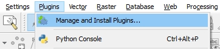
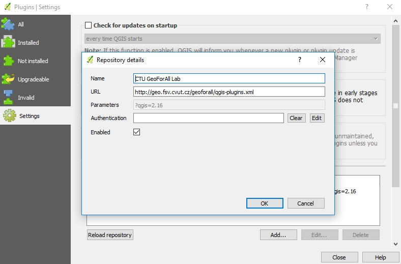

Installation

************

Among many ways to install the plugin the easiest one is to install it from 
the QGIS plugin repository.

1) From ``Plugins`` drop down menu select ``Manage and Install Plugins...``.

Open plugins dialog.

2) Go to ``Settings`` tab and press ``Add...`` button. Write
http://geo.fsv.cvut.cz/geoforall/qgis-plugins.xml to ``URL`` and press OK. 
This way you add a path to plugin's home repository CTU GeoForAll Lab because 
right now the plugin is not registered in the official QGIS repository. And 
right now plugin is distributed as experimental so in order to see it you have 
to tick the checkbox ``Show also experimental plugins``.

   Add home plugin's repository.
          
3) Go to ``All`` or ``Not installed`` tab and search for ``Radiation 
reconnaissance results``. 

3. Search for ``Ground Radiation Monitoring`` plugin on the ``All`` or 
``Not installed`` tab. After selecting the plugin, hit ``Install plugin``
button:

.. figure:: images/install_search_plugin.png

   Search and install the plugin.

4. The Ground Radiation Monitoring Plugin is ready to use with the icon
appearance in the QGIS toolbar:

.. figure:: images/install_toolbar.png

   Ground Radiation Monitoring Plugin on the QGIS toolbar.